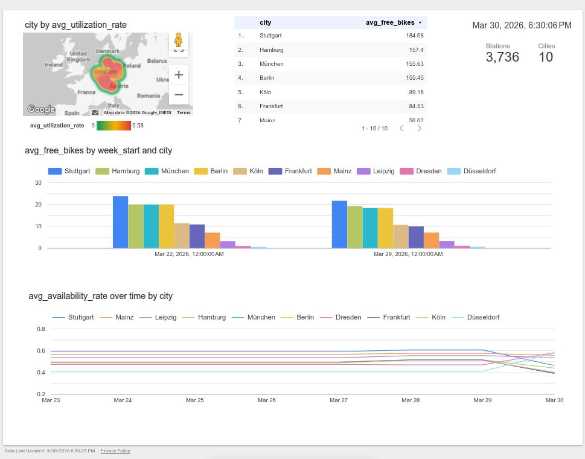
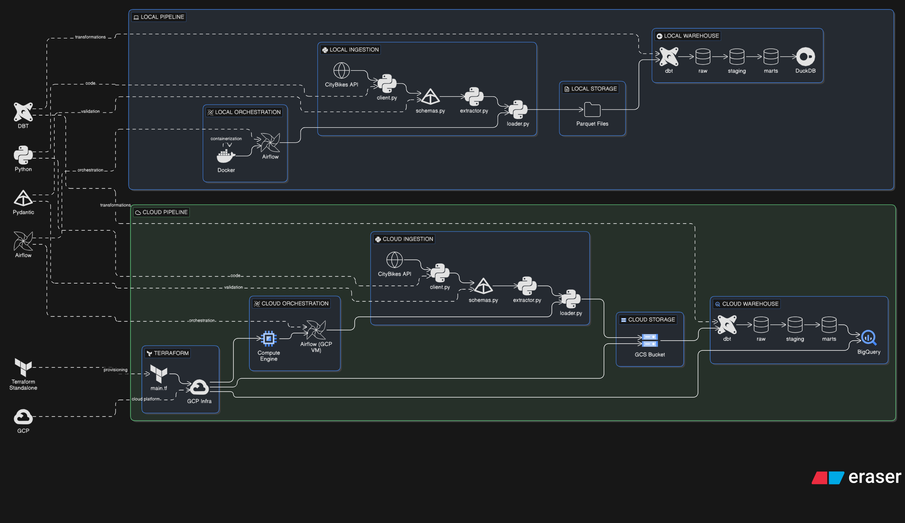

# 🚲 CityBikes ELT Pipeline – Compare Bike Sharing Across German Cities

**An end-to-end data pipeline that extracts, loads, and transforms real‑time bike‑sharing data from 12 major German cities. Run locally with DuckDB or deploy to Google Cloud with BigQuery. Perfect for learning modern data engineering or monitoring urban mobility trends.**

[](https://python.org)
[](https://docs.getdbt.com/)
[](https://airflow.apache.org/)
[](https://terraform.io)
[](https://opensource.org/licenses/MIT)

## 🏆 Project Highlights

- **Dual‑mode ELT pipeline**: Same code runs locally (DuckDB + Parquet) and in cloud (BigQuery + Google Cloud Storage) via abstract storage layer.
- **Production orchestration**: Apache Airflow schedules pipeline every 30 minutes – locally via Docker Compose, in cloud via GCP Compute Engine VM.
- **Infrastructure as Code**: Terraform automates provisioning of GCS bucket, BigQuery dataset, IAM service account, and optional VM.
- **Data warehouse best practices**: BigQuery tables partitioned by `date` and `city` for optimal query performance; DuckDB for local development.
- **Modern data stack**: Python 3.12 with Pydantic validation, dbt transformations, comprehensive data quality tests.
- **Real‑world analytics**: Compare bike‑sharing utilization across 12 German cities, identify hourly/weekly trends, rank stations.
- **Live Looker Studio dashboard**: Interactive visualization of city comparisons, hourly trends, station rankings, and weekly patterns.
- **Complete reproducibility**: Step‑by‑step instructions, automated `Makefile` setup, virtual environment isolation.

## 📊 Looker Studio Dashboard

The pipeline data marts are visualized in a **live Looker Studio dashboard** that compares bike‑sharing utilization across German cities:



**🔗 Live dashboard:** https://lookerstudio.google.com/reporting/83f8240b-7981-4292-8dde-1cc530d71407

The dashboard connects directly to the BigQuery data marts (cloud mode) and updates every 30 minutes as the pipeline runs.

## 📖 Overview

This pipeline compares bike‑sharing utilization across 12 major German cities by ingesting live station data every 30 minutes from the [CityBikes API](https://api.citybik.es/v2/), storing partitioned Parquet files (local or GCS), transforming with dbt into analyzable data marts, and orchestrating with Apache Airflow.

**What you’ll get:**

* **City‑level comparison**: Daily stations, average utilization, free‑bike ratios across Berlin, Hamburg, Munich, Cologne, Frankfurt, Stuttgart, Leipzig, Dresden, Düsseldorf, Mainz.
* **Hourly trends**: Usage peaks during rush hours in each city.
* **Station ranking**: Most‑ and least‑used stations in each network.
* **Weekly patterns**: Weekday vs. weekend activity.
* **Fully‑functional ELT pipeline** that can be extended, customized, or deployed as a production monitoring tool.

---

## 🛠️ Prerequisites

| Local Mode (DuckDB) | Cloud Mode (BigQuery / GCS) |
|---------------------|---------------------------|
| Python 3.12+        | Everything in local mode, plus: |
| Git                 | Google Cloud Platform account |
| Docker & Docker Compose (optional) | `gcloud` CLI authenticated |
|                     | Terraform ≥1.5 |

**All dependencies are managed inside a Python virtual environment; you never need to install packages globally.**

---

## 🏗️ Architecture at a Glance

The pipeline is built as a **dual‑mode ELT system**: the same code runs either locally (with DuckDB and local Parquet files) or in the cloud (with BigQuery and Google Cloud Storage). Orchestration is handled by Apache Airflow, scheduled every 30 minutes.



### 🔄 Data Flow

1.  **Extract** – Python client calls the CityBikes API, validates responses with Pydantic schemas, and adds ingestion timestamps.
2.  **Load** – Abstract storage layer writes partitioned Parquet files to either the local filesystem (`data/raw/date=.../city=...`) or a GCS bucket.
3.  **Transform** – dbt models turn raw data into **staging** (cleaned, typed) and **mart** tables (business‑level aggregates).
4.  **Orchestrate** – Airflow DAGs glue the steps together and run on schedule.
5.  **Visualize** (optional) – Connect Looker Studio to the BigQuery marts for live dashboards.

### 📦 Key Technologies

| Layer           | Local Stack              | Cloud Stack               |
|-----------------|--------------------------|---------------------------|
| **Storage**     | Parquet on disk          | Google Cloud Storage      |
| **Warehouse**   | DuckDB                   | BigQuery                  |
| **Orchestrator**| Airflow (Docker Compose) | Airflow (GCP Compute VM)  |
| **Infra as Code**| –                        | Terraform                 |

---

## 🚀 Let’s Get Started

Choose your path: **local mode** for quick experimentation, or **cloud mode** for a production‑like deployment. Both follow the same three‑step pattern:

1.  **Dry run** – execute the pipeline once manually.
2.  **Historical load** – generate realistic time‑series data for testing.
3.  **Orchestration** – schedule the pipeline to run automatically every 30 minutes.

---

## 🖥️ Local Mode (DuckDB + Parquet)

Run the pipeline locally with zero cloud dependencies.

### Step 0: Clone & Setup
```bash
git clone https://github.com/yourusername/citybikes-pipeline.git
cd citybikes-pipeline
make setup        # creates virtual environment, installs dependencies
make env-setup    # copies .env template (already configured for DuckDB)
```

### Step 1: Dry Run – Execute Pipeline Once
```bash
make pipeline     # runs: ingest‑local → dbt‑run → dbt‑test
```
Check results:
```bash
ls -la data/raw/*/*/*.parquet
duckdb citybikes.duckdb "SELECT city, COUNT(*) AS stations FROM stg_stations GROUP BY city;"
```

### Step 2: Historical Load – Generate Test Data
```bash
# Generate 7 days of data with 30‑minute intervals (default)
make historical-load

# Customize: 3 days, hourly intervals, only Berlin & Hamburg
make historical-load HISTORICAL_DAYS_BACK=3 HISTORICAL_INTERVAL_MINUTES=60 NETWORKS="callabike-berlin,stadtrad-hamburg-db"
```

### Step 3: Orchestration – Schedule with Airflow (Optional)
```bash
make airflow-up   # starts Airflow (PostgreSQL + LocalExecutor)
```
Open **http://localhost:8080** (admin/admin). DAG `citybikes_pipeline` runs every 30 minutes.

**Useful commands:**
```bash
make airflow-down       # stop Airflow (keeps volumes)
make airflow-reset      # stop and wipe all Airflow data
make clean              # remove virtual env, DuckDB file, raw data, dbt artifacts
```

---

## ☁️ Cloud Mode (BigQuery + Google Cloud Storage)

Deploy the pipeline to Google Cloud for a production‑ready setup. Data flows from the API → GCS bucket → BigQuery external table → dbt transformations → BigQuery marts.

### ⚙️ Step 0: Prerequisites & Authentication

1.  **Google Cloud Project** – create one in the [Cloud Console](https://console.cloud.google.com).

2.  **Install & authenticate gcloud CLI, Enable APIs**:
    ```bash
    gcloud auth login
    gcloud config set project YOUR_PROJECT_ID
    gcloud services enable \
    compute.googleapis.com \
    bigquery.googleapis.com \
    storage.googleapis.com \
    iam.googleapis.com \
    cloudresourcemanager.googleapis.com
    ```
3.  **In GCP Console → IAM & Admin → Service Accounts → Create:**
- Name: `citybikes-terraform-sa`
- Roles:
  - `roles/compute.admin`
  - `roles/iam.serviceAccountAdmin`
  - `roles/iam.serviceAccountKeyAdmin`
  - `roles/iam.serviceAccountUser`
  - `roles/resourcemanager.projectIamAdmin`
  - `roles/storage.admin`
  - `roles/bigquery.admin`

Download JSON key → save as `citybikes-pipeline/citybikes-terraform-sa-key.json`

4. **Set env/GOOGLE_APPLICATION_CREDENTIALS**
    ```
    GOOGLE_APPLICATION_CREDENTIALS=path/to/citybikes-terraform-sa-key.json
    ```

5.  **Install Terraform** (≥1.5) – [instructions](https://developer.hashicorp.com/terraform/install).

### 🏗️ Step 1: Provision Cloud Infrastructure with Terraform

The repository includes a Terraform module that creates a GCS bucket, BigQuery dataset, IAM service account, and (optionally) a Compute Engine VM for Airflow.

```bash
# 1. Navigate to terraform directory and copy the variables template
cd terraform
cp terraform.tfvars.example terraform.tfvars

# 2. Edit terraform.tfvars – fill in your GCP project ID and region
#    (leave other values as defaults unless you need to customize)

# 3. Return to project root and run the automated cloud setup
cd ..
make cloud
```

After `make cloud` completes, note the outputs: bucket name, dataset ID, service account email, and VM IP (if you opted for the VM module).

### 🔑 Step 2: Verify Environment Configuration (Optional)

The `make cloud` command already ran the helper scripts to configure your `.env` file. Verify that your `.env` contains the required cloud variables (`GCS_BUCKET_NAME`, `DBT_BIGQUERY_PROJECT`, `DBT_BIGQUERY_DATASET`, `DBT_BIGQUERY_KEYFILE`, …).

If you need to re-run the configuration scripts manually:

```bash
# Update .env with GCS bucket name, BigQuery dataset, project ID, etc.
python scripts/generate_gcp_env.py --format dotenv --update-env

# Create a service‑account key file and update DBT_BIGQUERY_KEYFILE in .env
python scripts/create_service_account_key.py
```

### 🧪 Step 3: Dry Run – Execute the Cloud Pipeline Once

With infrastructure ready, run the full cloud pipeline manually:

```bash
make cloud-pipeline
```

What happens:
1.  `STORAGE_BACKEND=gcs` – ingestion writes Parquet files directly to your GCS bucket.
2.  `DBT_TARGET=prod` – dbt uses the BigQuery profile and materializes models in BigQuery.
3.  The same five data marts are built in BigQuery, ready for analysis.

**Verify in BigQuery:**
*   Go to [BigQuery Console](https://console.cloud.google.com/bigquery).
*   You’ll see a dataset named `citybikes` (or whatever you configured) with tables `stg_stations`, `mart_station_utilization`, `mart_city_hourly_trends`, etc.

### 📅 Step 4: Historical Load – Generate Cloud Test Data

Generate historical Parquet files and upload them to GCS:

```bash
# Generate 7 days of data and store directly in GCS
make historical-load STORAGE_BACKEND=gcs GCS_BUCKET_NAME=$(grep GCS_BUCKET_NAME .env | cut -d= -f2)

# Customize days, interval, networks
make historical-load HISTORICAL_DAYS_BACK=3 HISTORICAL_INTERVAL_MINUTES=120 NETWORKS="callabike-berlin,stadtrad-hamburg-db" STORAGE_BACKEND=gcs
```

The script uses the same GCS storage backend as live ingestion, so the generated files land in the same bucket partition structure.


### ⏰ Step 5: Orchestration – Airflow on a GCP Compute Engine VM

If you used the Terraform `compute` module, a VM with Docker and the repository cloned is waiting for you. However, Airflow containers are not automatically started. Follow these steps to deploy Airflow and schedule the pipeline:

**Prepare the VM:**
1.  Note the VM external IP from Terraform outputs.
2.  Copy the `citybikes-pipeline-sa-key.json` to the VM.
    ```bash
    gcloud compute scp /path/to/citybikes-pipeline-sa-key.json \
    citybikes-airflow-vm:/opt/citybikes-pipeline/ \
    --zone=europe-west1-b \
    --project=YOUR_PROJECT_ID
    ```
3.  Copy your local `.env` file to the VM (required for environment variables):
    ```bash
    gcloud compute ssh citybikes-airflow-vm \
    --zone=europe-west1-b \
    --project=YOUR_PROJECT_ID
    ```
    ```bash
    cat > /opt/citybikes-pipeline/.env << 'EOF'
    DBT_BIGQUERY_PROJECT=your-gcp-project-id
    DBT_BIGQUERY_DATASET=citybikes
    DBT_BIGQUERY_LOCATION=europe-west1
    DBT_TARGET=prod
    GCS_BUCKET_NAME=your-bucket-name
    SERVICE_ACCOUNT_EMAIL=citybikes-pipeline-sa@your-gcp-project-id.iam.gserviceaccount.com
    EOF
    ```
    Add yourself to docker group:

    ```bash
    sudo usermod -aG docker $USER
    newgrp docker
    ```
4.  Start Airflow:
    ```bash
    cd /opt/citybikes-pipeline/airflow
    AIRFLOW_UID=$(id -u) docker compose up -d --build
    ```
    Wait 2–3 minutes for the containers to initialize.

**Access the cloud Airflow UI:**
1.  Open `http://<VM_IP>:8080` (login: `admin` / `admin`).
2.  The DAG `citybikes_cloud_pipeline` is already scheduled and will run every 30 minutes.

**What’s inside the VM setup:**
*   Docker and docker‑compose installed via startup script.
*   Repository cloned into `/opt/citybikes-pipeline`.
*   Firewall rules allow inbound traffic on ports 8080 (Airflow UI) and 22 (SSH).
*   The attached service account provides permissions to access GCS and BigQuery (no key file needed).

**Manual triggering from your local machine (optional):**
```bash
# Run the cloud pipeline remotely via SSH
gcloud compute ssh citybikes-airflow-vm --command "cd /opt/citybikes-pipeline && make cloud-pipeline"
```
### 🗑️ Step 6: Destroy Cloud Resources (When Done)

To avoid ongoing costs, tear down all created resources:

```bash
make cloud-destroy   # runs terraform destroy -auto-approve
```

**Warning:** This deletes the GCS bucket (and all data inside), BigQuery dataset, service account, and VM. Only run when you no longer need the pipeline.

---

## 🛠️ Makefile Cheat Sheet

The project’s `Makefile` is your Swiss‑army knife. Run `make help` to see all targets.

| Target | Description |
|--------|-------------|
| `make setup` | Create virtual environment and install all dependencies. |
| `make pipeline` | Local dry‑run: ingest → dbt run → dbt test. |
| `make ingest-local` | Fetch live data and store as local Parquet. |
| `make ingest-networks NETWORKS="..."` | Ingest only specific networks. |
| `make dbt-run` | Run dbt transformations (uses current target). |
| `make dbt-test` | Run dbt data quality tests. |
| `make historical-load` | Generate historical test data (local). |
| `make airflow-up` | Start local Airflow stack (Docker). |
| `make cloud` | Provision GCP infrastructure + configure `.env`. |
| `make cloud-pipeline` | Run full pipeline in cloud mode. |
| `make cloud-destroy` | Destroy all GCP resources. |
| `make test` | Run unit tests (pytest). |
| `make lint` | Lint Python code (flake8). |
| `make format` | Format code with black/isort. |
| `make clean` | Remove virtual env, data, DuckDB file, dbt artifacts. |

---

## 📚 Documentation

*   **[docs/architecture.md](docs/architecture.md)** – detailed architecture and data flow.
*   **[docs/structure.md](docs/structure.md)** – complete repository layout.
*   **[docs/progress.md](docs/progress.md)** – project phase completion status.
*   **[docs/decisions.md](docs/decisions.md)** – architectural decision records (ADRs).
*   **[CLAUDE.md](CLAUDE.md)** – development rules and phase order.

---

## 📄 License

MIT License

---

## 🙏 Acknowledgements

*   Data provided by the [CityBikes API](https://api.citybik.es/v2/).
*   Built with [Python](https://python.org), [dbt](https://docs.getdbt.com/), [Apache Airflow](https://airflow.apache.org/), [DuckDB](https://duckdb.org/), [BigQuery](https://cloud.google.com/bigquery), [Terraform](https://terraform.io).
*   Inspired by the need to compare urban bike‑sharing systems across Germany.

